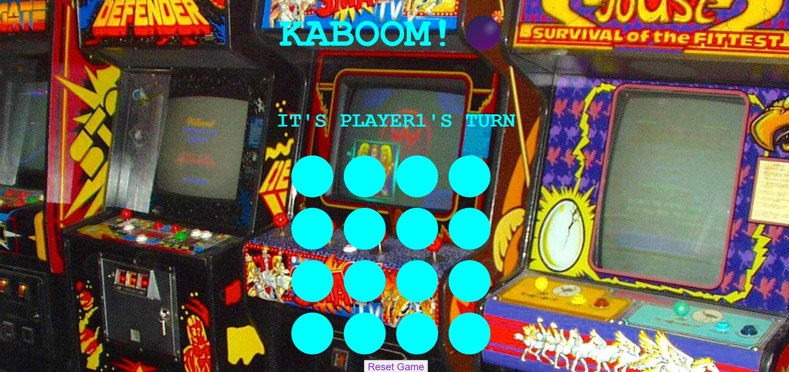
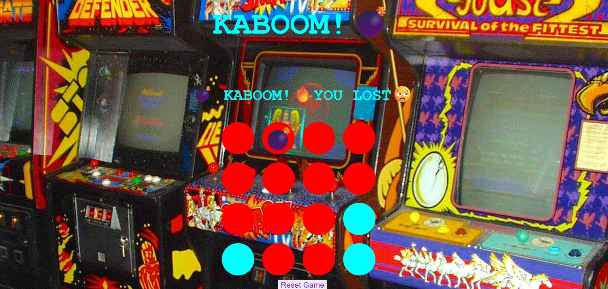

# ***Kaboom***

## **About Game**
is a interactive game were the object of the game is to try to not blow up! ( **Kaboom**)

Inspired by ***Tic-tac-toe*** and ***Minesweeper***, a new fast paced thriller game was born!

## **How To Play!**

players take turns choosing circles in hope of becoming the **last one standing.**

Once a circle is chosen, the circle will ***change color*** indacating that the space is now ***off limits***. (no double usage of the same circle)

Both players continue to pick circles until one player choses the bomb (***kaboom***)

***The player who dosen't chose the bomb (Kaboom) is the winner*** and the player who choses the bomb (***Kaboom***) has lost the game.

## **Features** 

Upon reset, ***all circles will regain its orginal color and all circles will be avaiable again.***

Also upon reset, the **bombs will change circles** so there will be more of a challenge and unpreditability and not just memory!

## **GamePlay** 

## ***Next Steps***
                               

        1. Add a timer to make it a fast paced game.

        2. Add a one player mode, where its you vs the computer.

        3. Make it online playable, so you can play against people all over the world.

 ## ***Refs Links/ Credits***
                                 

        Animations Link : https://animate.style/ 

        Image By TechRadar : https://cdn.mos.cms.futurecdn.net/tyRW8w6oRrzerPcDER5Sce-1200-80.jpg

##  ***Technologies Used***

                        CSS
                        HTML 
                        Javascript
                        Git

           
